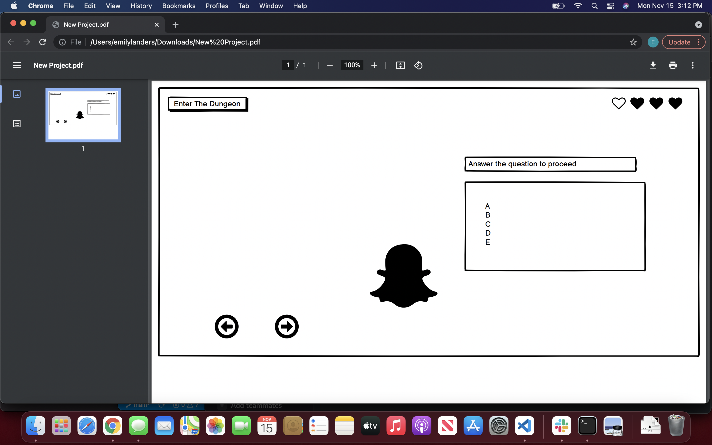

# 

Our Goal is to make a learning tool that exposes and reinforces vanilla JS/HTML/CSS topics.
Contributions by Emily Landers, Beau Hibbert, Joshua Frasure, and Michael Milsap.

https://trello.com/b/SXpCAMZZ/project-week 

Domain Model:
https://lucid.app/lucidchart/169e349f-074c-4052-8116-e93a1cde6517/edit?view_items=K7asQ3SG8wE0&invitationId=inv_98c658c8-5cda-40b1-aeb1-90b42b705bc4

